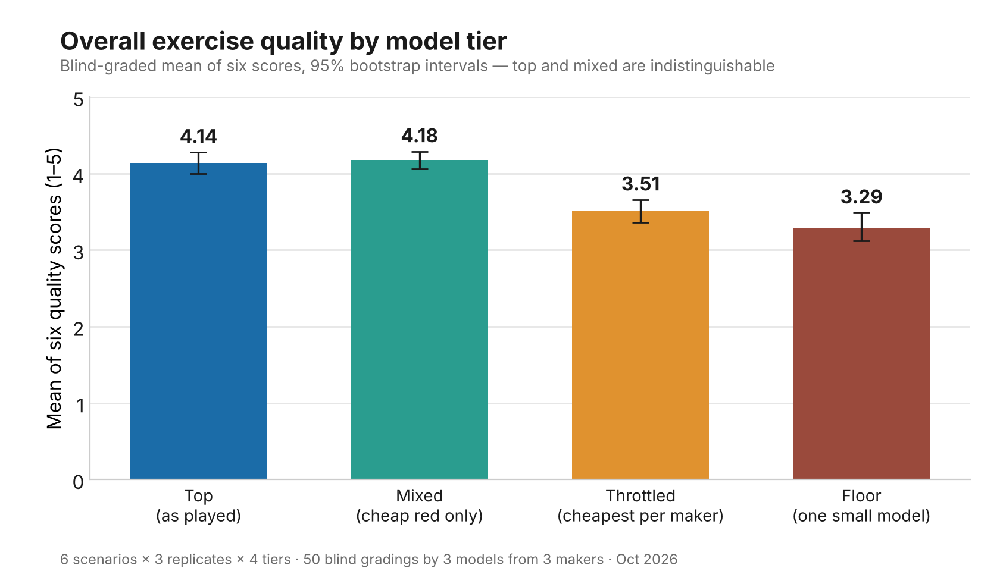
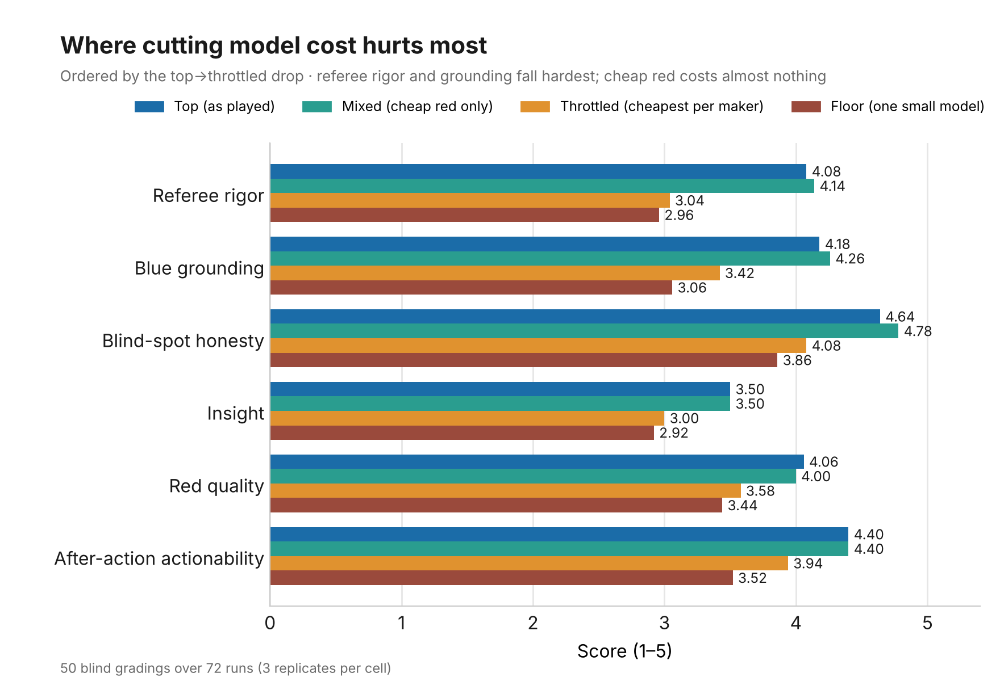
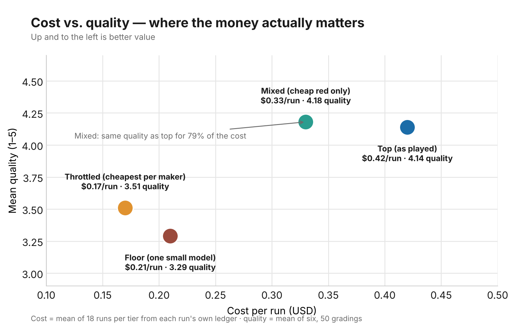
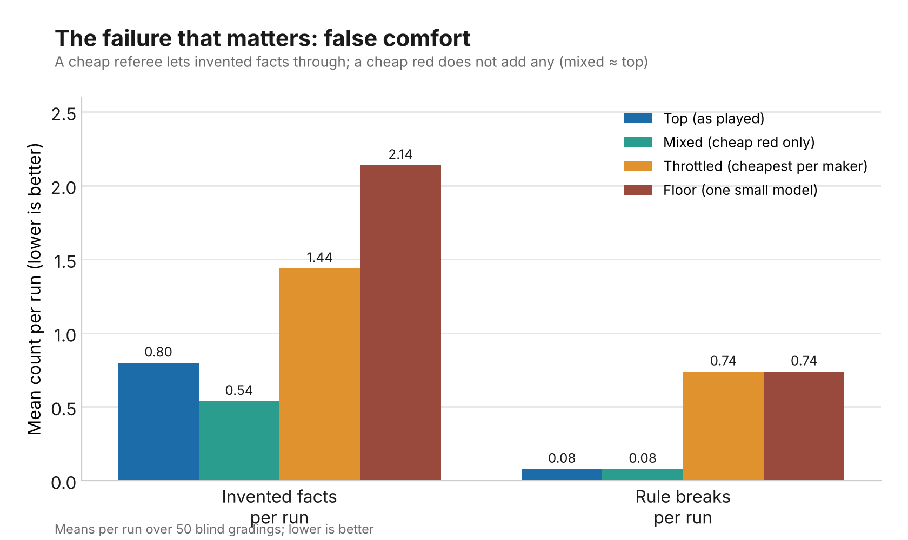

# Do cheaper models still make a useful security tabletop?

A measurement study of model-tier substitution in automated red/blue/purple
security exercises — with the grading method itself put under test.

When you run tabletop exercises with LLMs playing the seats — a red attacker,
a blue defender, a purple threat-hunter, a referee, a facilitator — the model
you pick for each seat drives the cost. This repo measures what you lose when
you swap in cheaper models, across 72 runs and 50 blind gradings, and then
asks the harder question: how much should you trust a 1–5 score from a model
grader in the first place?

Short version: **make the red seat cheap; keep the defender and the referee.**
A tier with only the red seat downgraded scored the same as the full-price
tier at 79% of the cost. Downgrading blue and the referee as well cut the
score sharply, and the single biggest collapse was referee rigor — the seat
whose job is to catch invented facts.

> **Scope.** Run against a personal, self-hosted home-assistant system as a
> hobby project. Defensive measurement only: no attack tooling, no exploit
> code, no payloads. Scenario names and system details are genericized;
> numbers are unchanged.

---

## TL;DR

- Four tiers × six scenarios × **three replicates** = 72 runs, each transcript
  blind-graded by three models from three makers (50 valid gradings).
- **Overall quality (mean of six 1–5 scores):** top **4.14**, mixed **4.18**,
  throttled **3.51**, floor **3.29** (95% bootstrap intervals in the chart).
- **Top vs mixed: no difference** (paired wins 22 / 25, p = 0.77). The mixed
  tier — cheap red, everything else as played — costs $0.33 a run against
  $0.42.
- **Both beat throttled and floor** on every dimension (sign tests, p ≈ 10⁻⁵
  to 10⁻⁶). Referee rigor drops from 4.1 to 3.0; invented facts roughly triple
  (0.5–0.8 → 1.4–2.1 per run); rule breaks go from 0.08 to 0.74 per run.
- **Throttled vs floor is marginal** (p = 0.08); the first run's "floor is
  dominated" was an over-read of one replicate.
- **The grading scale is reliable for ordering, not for decimals.**
  Krippendorff's alpha across the three graders is 0.45 overall and 0.33 on
  blue grounding; a planted fabricated control was caught 3 of 3 times by one
  grader and 1 of 3 by another. The tier *ordering* survives everything we
  threw at it; individual dimension scores do not.



---

## Background: the exercise

Each run is a scripted tabletop with five seats:

| Seat | Job |
|---|---|
| Facilitator | Sets the scene and injects a twist between rounds |
| Red | Proposes the attacker's moves (technique level only) |
| Blue | Defends; names what would detect or stop each move |
| Purple | Threat-hunts, grades coverage, writes the after-action |
| Referee | Rules each round, scores it, calls out unearned claims |

Format: 3 rounds, 16 turns. Each turn is capped at 120 words and kept at
**technique level** — ATT&CK-style technique names, no commands and no code.
Every seat is given the same system description and the same list of known
open weaknesses. No turn carries chat history; the last 8 turns are passed in
the prompt.

## The four tiers

| Seat | `top` (as played) | `mixed` (cheap red only) | `throttled` (cheapest per maker) | `floor` (one small model) |
|---|---|---|---|---|
| Facilitator | claude-haiku-4-5 | claude-haiku-4-5 | claude-haiku-4-5 | claude-haiku-4-5 |
| Red | gemini-pro-latest | **gemini-flash-latest** | gemini-flash-latest | claude-haiku-4-5 |
| Blue | claude-sonnet-5 | claude-sonnet-5 | claude-haiku-4-5 | claude-haiku-4-5 |
| Purple | glm-5-2 | glm-5-2 | glm-5-2 | claude-haiku-4-5 |
| Referee | claude-sonnet-5 | claude-sonnet-5 | claude-haiku-4-5 | claude-haiku-4-5 |

`mixed` was added after a pilot run suggested the red seat didn't need the
expensive model. The cheap red class gets the same output budget as the normal
one so a thinking model's hidden tokens can't truncate replies.

## Scenarios and replicates

Six home-network scenario families (genericized labels): `edge_gateway`,
`cloud_camera`, `smart_speakers`, `ble_vehicle`, `account_takeover`,
`carrier_vishing`. Each scenario × tier was run **three times**, strictly
sequentially (an earlier parallel run had inflated costs), 72 runs in all.

## How it was graded

For each scenario and replicate, the four tier transcripts had their title
and seat lines removed, were shuffled under labels A–D, and were scored by
three graders from three makers (claude-sonnet-5, gemini-pro-latest,
kimi-k2-6) against a fixed rubric, with the system description and the
known-weakness list given as ground truth. Six quality scores (1–5): red
quality, blue grounding, blind-spot honesty, referee rigor, after-action
actionability, insight beyond the known list. Three counts: invented facts,
distinct fixes, rule breaks. Plus a forced best-to-worst ranking.

50 of 54 gradings parsed. The Claude grader failed four sets (one empty
reply, one unparseable, two provider errors); the other two graders were
complete. The provider errors turned out to be a monthly API spend limit on
the grading key, reached mid-batch — not a refusal. The failures are not
random (two of the four are the same scenario), so the Claude column is
slightly thinner on that scenario; the tier ordering is unchanged with or
without it.

The rubric is ours; the method is the standard LLM-as-judge approach (blind,
rubric-scored, several graders from different makers; cf. Zheng et al.,
*Judging LLM-as-a-Judge with MT-Bench and Chatbot Arena*, 2023). The scores
are ordinal and we average them as if interval. See **How much to trust the
scale** below before reading any decimal.

---

## Results

### Where cheaper seats hurt



| Dimension | top | mixed | throttled | floor |
|---|---:|---:|---:|---:|
| Red quality | 4.06 | 4.00 | 3.58 | 3.44 |
| Blue grounding | 4.18 | **4.26** | 3.42 | 3.06 |
| Blind-spot honesty | 4.64 | **4.78** | 4.08 | 3.86 |
| Referee rigor | 4.08 | **4.14** | 3.04 | 2.96 |
| After-action actionability | 4.40 | 4.40 | 3.94 | 3.52 |
| Insight | 3.50 | 3.50 | 3.00 | 2.92 |
| **Mean of six** | **4.14** | **4.18** | 3.51 | 3.29 |
| Invented facts (per run) | 0.80 | **0.54** | 1.44 | 2.14 |
| Rule breaks (per run) | 0.08 | 0.08 | 0.74 | 0.74 |

Paired within each grading — each of the 50 gradings scored all four
tiers, so every pair is a within-grading comparison. Exact two-sided binomial
sign test on the discordant pairs; ties (identical mean of six) are listed
and excluded, as is standard.

| Pair | mean diff | wins / losses / ties | n discordant | p |
|---|---:|---:|---:|---:|
| top vs mixed | −0.04 | 22 / 25 / 3 | 47 | 0.77 |
| mixed vs throttled | +0.67 | 39 / 7 / 4 | 46 | 2 × 10⁻⁶ |
| top vs throttled | +0.63 | 37 / 8 / 5 | 45 | 2 × 10⁻⁵ |
| throttled vs floor | +0.22 | 30 / 17 / 3 | 47 | 0.08 |

Per grader (mean of six; n = gradings that parsed):

| Grader | n | top | mixed | throttled | floor | order |
|---|---:|---:|---:|---:|---:|---|
| claude-sonnet-5 | 14 | 4.37 | 4.40 | 3.32 | 3.21 | mixed > top > throttled > floor |
| gemini-pro-latest | 18 | 4.21 | 3.98 | 3.69 | 3.51 | top > mixed > throttled > floor |
| kimi-k2-6 | 18 | 3.90 | 4.20 | 3.47 | 3.14 | mixed > top > throttled > floor |

All three put {top, mixed} above {throttled, floor}. The one disagreement is
instructive: Gemini — whose own model plays the red seat in `top` and is
replaced by its cheaper sibling in `mixed` — is the only grader that prefers
`top`. Claude plays blue and referee in both tiers and has no stake in the
difference; Kimi plays no seat. That is consistent with mild self-preference
and is the reason the design uses three makers. The ordering held in each of
the three replicates.

### Cost vs. quality



| | top | mixed | throttled | floor |
|---|---:|---:|---:|---:|
| Cost per run (mean of 18) | $0.42 | **$0.33** | $0.17 | $0.21 |
| Total words | 2,356 | 2,296 | 2,933 | 3,623 |
| Turns over 150 words (of 15) | 5.5 | 5.1 | 7.7 | 11.5 |
| Turns a seat stopped playing | 0 | 0 | 0 | 0.11 |
| Grade points per dollar | 9.9 | 12.7 | 20.6 | 15.7 |

Swapping the red seat alone saves 21% with no measurable loss. Swapping blue
and the referee too saves another 40% and costs about 0.7 of a grade point —
and most of that saving is illusory, because the cheap seats write more words
(the floor tier writes 54% more than top and costs more than throttled).

### Trust failures



A weak red seat makes a dull exercise. A weak blue or referee makes a *wrong*
one. The referee is the seat whose job is to reject invented facts, and
referee rigor is the dimension that falls furthest (4.1 → 3.0) when it is
downgraded; invented facts and rule breaks rise with it. In the one scenario
read in full across tiers, the cheap blue claimed a port scan would show in
DNS logs, confused a Wi-Fi join with an application sign-in, and asserted an
audit trail that doesn't exist — and the cheap referee accepted all of it.

### Preference model

Fitting a Bradley-Terry model to the 50 forced rankings (pairwise
preferences are more reliable than absolute scores):

| Tier | strength | 95% bootstrap |
|---|---:|---|
| mixed | 1.70 | 1.27–2.15 |
| top | 1.54 | 1.10–2.07 |
| throttled | 0.44 | 0.27–0.63 |
| floor | 0.32 | 0.18–0.51 |

P(mixed preferred over top) = 0.52; over throttled 0.80; over floor 0.84.

---

## How much to trust the scale

This is the part most LLM-judge studies skip. We measured it three ways.

**1. Inter-rater reliability.** Krippendorff's alpha on the per-transcript
mean of six, across the three graders: **0.45** (interval). By dimension,
interval / ordinal: after-action actionability 0.55 / 0.35, referee rigor
0.45 / 0.41, blind-spot honesty 0.41 / 0.40, red quality 0.33 / 0.31, blue
grounding 0.33 / 0.32, insight **0.07 / 0.06**; of the counts, rule breaks
0.60 / 0.50 and invented facts 0.24 / 0.22. The usual reading is that scores
below ~0.67 should not be interpreted individually. The tier *ordering* is
nonetheless robust: it reproduces across graders, replicates, and the
pairwise model above. "Insight" is noise and we do not use it for any claim.
(`data/raw_gradings.csv` has every score.)

**2. Planted-fault probe (exploratory, N = 3).** We took three top-tier
transcripts, inserted one fabricated control claim into a blue turn (a SIEM,
a NetFlow collector, an EDR agent — none of which the system has), and had
each grader score the original and the planted copy blind as a pair.
Detection = lower blue grounding or higher invented-facts on the planted
copy. **Gemini: 3 of 3. Kimi: 1 of 3** (two planted copies scored
identically to their originals). The Claude grader could not be run (spend
limit). Three pairs is a probe, not a benchmark — but a grader that cannot
see a planted SIEM in a 2,300-word transcript is not measuring grounding, and
this is the most direct explanation for the low alpha on that dimension. A
larger version (30 pairs, three graders, varied plant types) is the obvious
follow-up.

**3. An objective proxy (code, no judge).** We matched every watcher or
control a blue turn names against two fixed vocabularies drawn from the
system description — things it has, things it does not — with negation
("there's no IDS here") and proposals ("we should add VLANs") excluded
(`data/controls_vocab.json`, genericized).
Invented-control *claims* per run: top 0.56, mixed 0.17, throttled 0.61,
floor 0.67; grounding precision 0.95 / 0.98 / 0.95 / 0.94. The proxy agrees on
direction and is far flatter than the judges. The reason is instructive: it
catches *invented controls* but not *real watchers credited with things they
can't see*, which is the commoner cheap-blue failure. A watcher→capability
table would close that gap and is the next version of this metric.

**4. Human grading.** A blind packet of six transcripts is being graded by a
human against the same rubric; human-vs-model agreement will be added here.

---

## What the numbers mean

1. **Red doesn't need the expensive model.** Attack ideas at technique level
   are easy; the cheap red held up across three replicates and all three
   graders. A plausible reason (untested here): red's task is to produce a
   120-word move at ATT&CK-technique level, which is abundant in pretraining,
   while blue and the referee must verify specific claims against an
   ~8,500-token system description — a grounded-verification task where
   capability differences show.
2. **Blue and the referee are where the money matters.** The referee in
   particular: it is the exercise's immune system, and a cheap one lets
   invented facts through.
3. **Throttling saves less than the price list suggests.** Most of the bill is
   re-sent input (persona, system description and weakness list, ~8,500
   tokens per call), and cheap models write more words. Prompt caching on the
   re-sent prefix would cut every tier's cost more than any model swap, and is
   the first thing to try before downgrading a seat.
4. **One small model in every seat is not even the cheapest option** and
   occasionally stops role-playing (2 of 18 runs).
5. **Trust the ordering, not the decimals.** The grading scale is fine for
   "which tier is better" and poor for "how much better"; one of three graders
   is nearly blind to the failure the headline is about.

**Practical configuration:** cheap red, normal blue and referee. That is the
mixed tier, and it is what we now run.

## Things found along the way

- **A frontier model declined the grading job outright** in the pilot
  (refusal stop-reason, no text, input still billed). Log provider refusals
  explicitly; the harness didn't, so the caller saw an empty reply.
- **A spend limit, not a refusal, took out one grader mid-study.** The
  replicate batch pushed the grading key past its monthly limit; every later
  call failed with a 400. If your graders share a billing key with anything
  else, a big batch can silently take that other thing offline too. Separate
  keys per workload.
- **A cheap referee with tools pulled live system data into a fiction
  exercise.** Run drills with tool access off.
- **The ground truth contradicted itself** on one point (the system
  description said a network rule was in force; the weakness list said it was
  drafted, not applied). Graders were scoring against an inconsistent spec on
  that item. Check your own ground truth before blaming the graders.
- **Graders are order-sensitive.** In the pilot, the same grader reproduced
  its own full ranking in only 8 of 16 order-swapped pairs.

## Limitations

- Six scenarios from one system; one prompt design; one rubric.
- Two of the three graders also play seats in the top tier (labels were
  blind, but style preference is possible). The third grader, which plays no
  seat, agreed on the ordering.
- The replicate batch was graded in one order per set (the pilot used two);
  test-retest comes from the pilot only.
- Scenario selection was by cost, not random.
- The objective proxy is a term list; see above for what it misses.
- "Stopped playing" and word counts are pattern matches over transcripts.

## Cost of the study

Runs: **$20.32** summed over the 72 per-run ledgers (mean $0.28; tier means
× 18 give the same $20.32). The provider-side research bucket moved $20.61
over the same window; the $0.29 difference is four failed attempts that were
retried and produced no transcript. Grading $3.44; planted-fault probe
$0.10. Pilot (Oct 4): $7.68. **Total: $31.54.**

## Reproduce

The exercise harness is part of a larger private system and isn't published
here. What's published is enough to check and redraw every result:

- `data/raw_gradings.csv` — every score from every grader for every
  transcript (200 rows), with rank position; no free text.
- `data/grades.csv`, `data/summary.csv`, `data/cost.csv`,
  `data/reliability.csv` — the aggregates behind every chart and table.
- `data/rubric.md` — the rubric verbatim, with the 1/3/5 anchors.
- `data/controls_vocab.json` — the objective proxy's vocabulary (genericized)
  and its negation/proposal rules.
- `make_charts.py` — regenerates the four figures from `data/`
  (`requirements.txt`: matplotlib, numpy).

```bash
python make_charts.py   # writes charts/*.png
```

The rubric (six 1–5 scores with anchors, three counts, a forced ranking), the
blind-shuffle procedure, the tier table, the reliability method (Krippendorff's
alpha, interval; Bradley-Terry on rankings with bootstrap; planted-fault
pairs) and the grounding vocabulary approach are the design; anyone could
rebuild the harness from them.

## License & disclaimer

- Text, data and charts: CC-BY-4.0. Code: MIT. See `LICENSE`.
- Personal hobby project. Defensive measurement only. Not affiliated with or
  endorsed by any employer; no operational data of any kind is involved.
- Model names are the versions available at test time (Oct 2026), named only
  to make the result reproducible.
